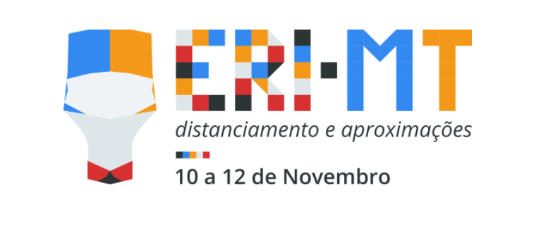

# Oficina 4 - Evento ERI-MT 2021  

A ERI-MT (Escola Regional de Informática de Mato Grosso) é promovida anualmente pelas Instituições de Ensino Superior (IES) do estado de Mato Grosso desde sua primeira edição realizada em 2009. O evento é reconhecido como sendo o maior da área de Computação e de TI do estado e apoiado pela Sociedade Brasileira de Computação (SBC).
Este ano, a 11ª edição da ERI-MT está sendo organizada pela Universidade Federal de Rondonópolis (UFR) – antigo Campus da UFMT. O tema desta edição é “Distanciamento e Aproximações”, o qual traz uma reflexão sobre o momento atual de isolamento, em que precisamos buscar novas formas de nos aproximarmos. O meio digital é a forma de aproximação cujas possibilidades estão sendo mais exploradas, portanto, este foi o meio escolhido para a realização do evento.

     

## Deploy na plataforma Netlify da aplicação que foi desenvolvida 
https://minicurso-react-keliane.netlify.app/

## Video aula do desenvolvimento da aplicação
https://www.youtube.com/watch?v=iEzLiVN1EE8&t=3550s&ab_channel=DouglasOliveira
